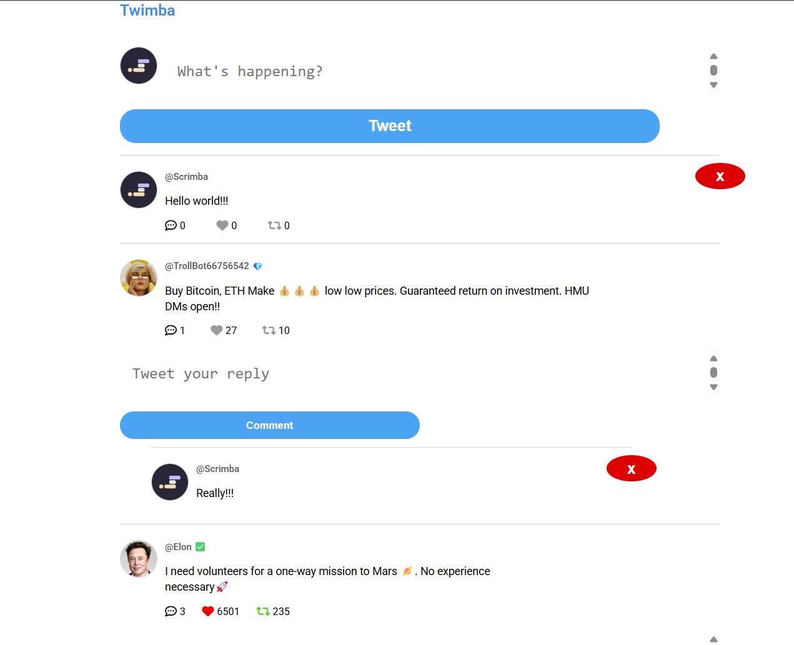

# Twimba - A Twitter Clone (Mini-Project)

Twimba is a simplified, interactive Twitter clone built with HTML, CSS, and JavaScript. It allows users to post "tweets," like and retweet them, reply to tweets, and delete their own tweets and replies. This project demonstrates fundamental web development concepts and provides a hands-on experience with DOM manipulation, event handling, and data management.

## Screenshot

+

## Features

*   **Tweet Creation:** Users can write and post tweets.
*   **Like/Unlike:** Users can like and unlike tweets.
*   **Retweet:** Users can retweet and un-retweet tweets.
*   **Replies:** Users can reply to existing tweets.
*   **Delete:** Users can delete their own tweets and replies.
*   **Dynamic Feed:** The tweet feed updates in real-time as users interact.
*   **Local Storage:** Tweet data is persisted in the browser's local storage, so it remains even after refreshing the page.
* **Responsive Design:** The layout adapts to different screen sizes.

## Technologies Used

*   **HTML:** For structuring the web page.
*   **CSS:** For styling and layout.
*   **JavaScript:** For interactivity, DOM manipulation, and data management.
*   **Font Awesome:** For icons.
*   **Google Fonts:** For custom typography.
*   **UUID:** For generating unique identifiers for tweets and replies.
* **Local Storage:** For storing the tweets data.

## Project Structure

*   **`index.html`:** The main HTML file that defines the structure of the web page.
*   **`index.css`:** The CSS file that contains the styling rules for the project.
*   **`index.js`:** The JavaScript file that handles the application's logic and interactivity.
*   **`data.js`:** Contains the initial tweet data.
*   **`images/`:** A directory containing images used in the project (profile pictures, etc.).

## Setup and Installation

1.  **Clone the repository:**
    ```bash
    git clone <repository-url>
    ```
    (Replace `<repository-url>` with the actual URL if you were to host this on a git repository)

2.  **Navigate to the project directory:**
    ```bash
    cd twitter-clone
    ```

3.  **Open `index.html` in your web browser.**

## How to Use

1.  **Post a Tweet:** Type your message in the "What's happening?" text area and click the "Tweet" button.
2.  **Like a Tweet:** Click the heart icon below a tweet.
3.  **Retweet a Tweet:** Click the retweet icon below a tweet.
4.  **Reply to a Tweet:** Click the comment icon below a tweet. A reply input area will appear. Type your reply and click "Comment".
5. **Delete a tweet/reply:** Click the "x" button on the top right of the tweet/reply.

## Key JavaScript Functionality

*   **Event Handling:** Event listeners are used to detect user interactions (clicks on like, retweet, reply, tweet, and delete buttons).
*   **DOM Manipulation:** JavaScript dynamically updates the HTML content based on user actions.
*   **Data Management:** The `tweetsData` array (in `data.js` and modified in `index.js`) stores the tweet information.
*   **Local Storage:** The `localStorage` API is used to persist tweet data across browser sessions.
* **UUID:** The `uuid` library is used to create unique id's for each tweet and reply.

## Future Improvements

*   **User Authentication:** Implement user login/registration.
*   **More Robust Styling:** Enhance the visual appeal and responsiveness.
*   **Image/Video Support:** Allow users to post media.
*   **Hashtags and Mentions:** Implement hashtag and mention functionality.
*   **Search:** Add a search feature to find tweets.
* **Backend Integration:** Integrate with a backend database for more persistent data storage and user management.

## Credits

This project was created as a learning exercise to practice front-end web development skills.THe motivation and guidance is from Scrimba

## License

MIT (or add your preferred license)
